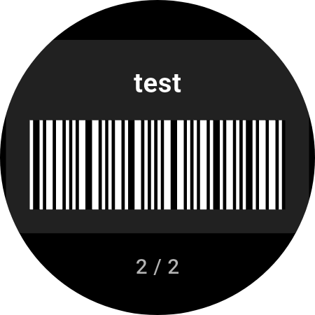
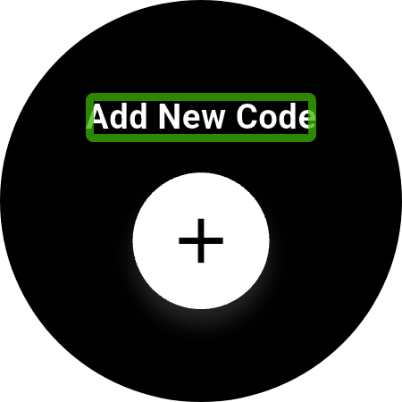
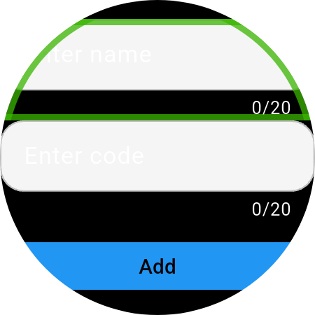
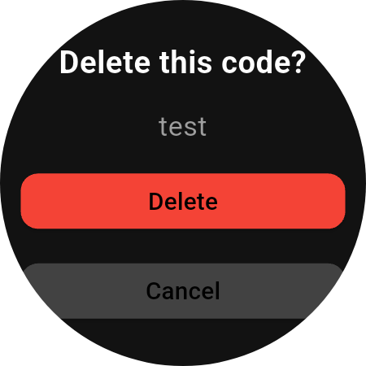

# WearCodes


A simple and efficient Flutter application for Wear OS that allows you to store and display barcodes directly on your smartwatch. Never forget your loyalty cards, gym membership, or library card again!

## 🌟 Features

- **Store Multiple Codes:** Add and manage a list of barcodes with custom names.
- **Clear Barcode Display:** Generates and displays crisp Code 39 barcodes optimized for smartwatch screens.
- **Intuitive Navigation:** Seamlessly cycle through your saved codes using the watch's rotary input (bezel or crown).
- **On-Device Management:** Add new codes or delete existing ones directly from the watch.
- **Haptic Feedback:** Physical confirmation for interactions like scrolling and adding codes.
- **Persistent Storage:** Your codes are saved locally on your device for quick access.

## 📲 How It Looks

| Main Screen | Add Screen |
| :---: | :---: |
|  |  |
| *View your saved barcodes.* | *Scroll to the end to add a new one.* |

| Add Dialog | Delete Dialog |
| :---: | :---: |
|  |  |
| *Enter a name and the code data.* | *Long-press a card to delete it.* |

## 🛠️ Tech Stack & Dependencies

- **Framework:** [Flutter](https://flutter.dev/)
- **Platform:** Wear OS
- **Key Packages:**
  - `wear_plus`: For adapting the UI to different watch shapes (round/square).
  - `wearable_rotary`: To enable navigation with the physical rotating bezel or crown.
  - `barcode_widget`: For generating the barcode images.
  - `shared_preferences`: For storing the barcode data locally on the device.

## 🚀 Installation & Setup

There are two ways to get the app on your watch: by installing the official release or by building it yourself from the source code.

### For Users (Easy Install)

This method is recommended for most users. You will download the ready-to-install app file and sideload it onto your watch.

1.  **Download the latest release:**
    Go to the [GitHub Releases page](https://github.com/your_username/wearcodes/releases) and download the latest `.apk` file from the "Assets" section.

2.  **Sideload the APK to your watch:**
    You will need to use a tool to install the APK file on your watch. This process is called "sideloading." It requires enabling developer options on your watch.

    For a detailed, user-friendly guide, follow the instructions here: [How to Sideload Apps on Wear OS](https://www.howtogeek.com/792549/how-to-sideload-apps-on-wear-os/)

### For Developers (Build from Source)

This method is for developers who want to modify the code or build the app themselves.

1.  **Set up Flutter:**
    If you don't have Flutter installed, follow the official guide to get started: [Flutter Documentation](https://docs.flutter.dev/get-started/install).

2.  **Clone the repository:**
    ```sh
    git clone https://github.com/your_username/wearcodes.git
    cd wearcodes
    ```

3.  **Install dependencies:**
    ```sh
    flutter pub get
    ```

4.  **Run the app (Debug Mode):**
    Connect your Wear OS device or start an emulator, then run:
    ```sh
    flutter run
    ```

5.  **Build the app (Release Mode):**
    To build the release `.apk` file that you can install or distribute, run:
    ```sh
    flutter build apk --release
    ```
    The output file will be located in `build/app/outputs/flutter-apk/app-release.apk`.

## Usage

- **Scroll Through Codes:** Use the rotary input (bezel/crown) on your watch to switch between saved barcodes.
- **Add a New Code:** Scroll to the very end of your list to find the "Add New Code" card and tap the `+` button.
- **Delete a Code:** Long-press on any barcode card to bring up the delete confirmation screen.

## 📝 To-Do

Here are some ideas for future improvements:

- [ ] Support more barcode formats (e.g., QR Code, Code 128).
- [ ] Allow reordering the list of saved codes.
- [ ] Add the ability to edit an existing code's name or data.
- [ ] Improve UI/add theme options.
- [ ] Investigate a companion phone app for easier code management.

## 📄 License

Distributed under the GPLv3 License. See `LICENSE` for more information.