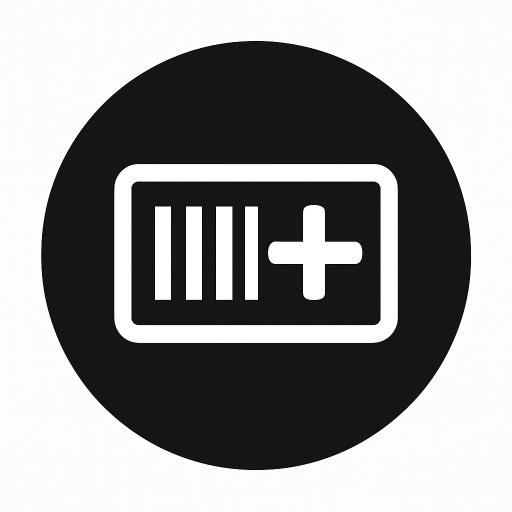

# WearCodes



[](LICENSE)


*A lightweight Flutter app that turns your smartwatch into a digital wallet for barcodes.*

## Features

* Store Multiple Codes: Add and manage a list of barcodes with custom names.
* Clear Barcode Display: Crisp Code 39 barcodes optimized for smartwatch screens.
* Intuitive Navigation: Seamlessly cycle through your saved codes using the watch's rotary input (bezel or crown).
* On-Device Management: Add new codes or delete existing ones directly from the watch.
* Haptic Feedback: Physical confirmation for interactions like scrolling and adding codes.
* Persistent Storage: Your codes are saved locally on your device for quick access.

## How It Looks

|                  Main Screen                  |               Add Screen              |
| :-------------------------------------------: | :-----------------------------------: |
|  |  |
|          *View your saved barcodes.*          | *Scroll to the end to add a new one.* |

|                   Add Dialog                   |                 Delete Dialog                 |
| :--------------------------------------------: | :-------------------------------------------: |
|  |  |
|        *Enter a name and the code data.*       |       *Long-press a card to delete it.*       |

## Tech Stack & Dependencies

* Framework: [Flutter](https://flutter.dev/)
* Platform: Wear OS
* Key Packages:

  * [wear_plus](https://pub.dev/packages/wear_plus) — Adapts UI to different watch shapes (round/square).
  * [wearable_rotary](https://pub.dev/packages/wearable_rotary) — Navigation with bezel/crown.
  * [barcode_widget](https://pub.dev/packages/barcode_widget) — Generates barcode images.
  * [shared_preferences](https://pub.dev/packages/shared_preferences) — Local storage for barcode data.

## Installation & Setup

There are two ways to get the app on your watch: install the release build or build from source.

### install

1. Download the latest release:
   grab the latest release from the [Releases page](https://github.com/techexplorers123/wearcodes/releases/latest)

2. Sideload the APK to your watch:
   Use adb to install the APK (requires enabling developer options).
   👉Follow this guide: [How to Sideload Apps on Wear OS](https://www.howtogeek.com/792549/how-to-sideload-apps-on-wear-os/)

> 📌 Note: Play Store release planned soon!

### Build from Source

1. Set up Flutter: [Flutter Installation Guide](https://docs.flutter.dev/get-started/install)
2. Clone the repository:

   ```sh
   git clone https://github.com/your_username/wearcodes.git
   cd wearcodes
   ```
   
3. Install dependencies:

   ```sh
   flutter pub get
   ```
   
4. Run in Debug Mode:

   ```sh
   flutter run
   ```
   
5. Build Release APK:

   ```sh
   flutter build apk --release
   ```

   Output is saved at: build/app/outputs/flutter-apk/app-release.apk

## Usage

* Scroll Through Codes: Use the rotary input to switch between barcodes.
* Add a New Code: Scroll to the end → Tap +.
* Delete a Code: Long-press a card → Confirm delete.

## To-Do (Planned Features)

* [ ] Support more barcode formats (QR Code, Code 128, ...).
* [ ] Reordering of saved codes.
* [ ] Edit existing code name/data.
* [ ] Theming & UI improvements.
* [ ] Companion phone app for easier management.
* [ ] Publish to Google Play Store.
* [ ] support for tiles on watch.

## 🤝 Contributing

Contributions, issues, and feature requests are welcome!

* Open an [issue](https://github.com/techexplorers123/wearcodes/issues) for bugs or ideas.
* Submit a pull request to contribute improvements.

## 📄 License

This project is licensed under the [GNU General Public License v3.0 or later (GPLv3+)](LICENSE).
